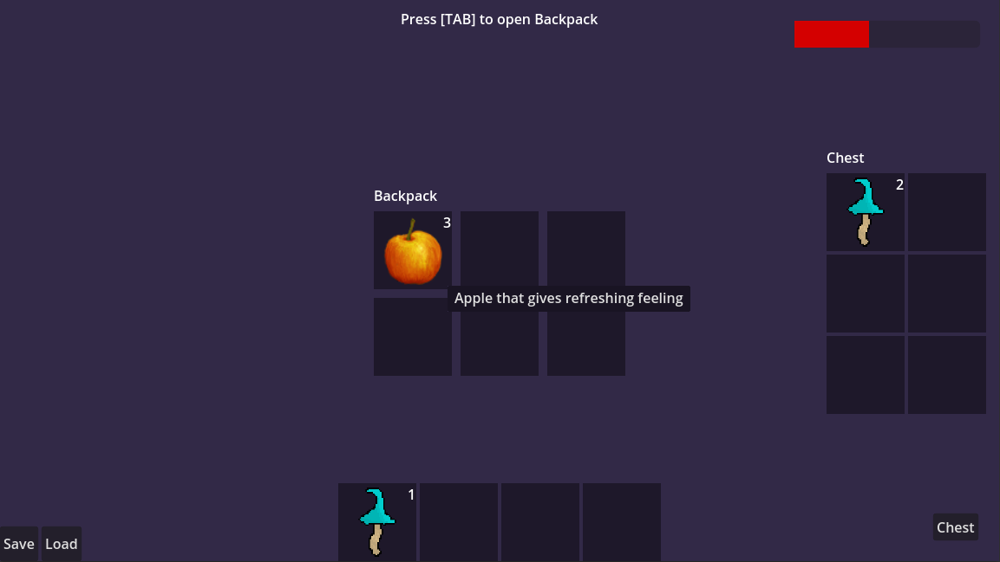

# Basic Example

Highly suggesting to go through this example and look at everything you can find to get a feeling of how everything is working together!

You can find it under _res://examples/basic/basic.tscn_

It includes:
- Player with HealthBar, Backpack Inventory, Hotbar
- `AddItem` scene that shows how to add items to the inventory when you press it.
- Chest, that can be opened and it has it's own Inventory Component
- Saving and Loading
- Creating Abstract Item Food and using it to create more items