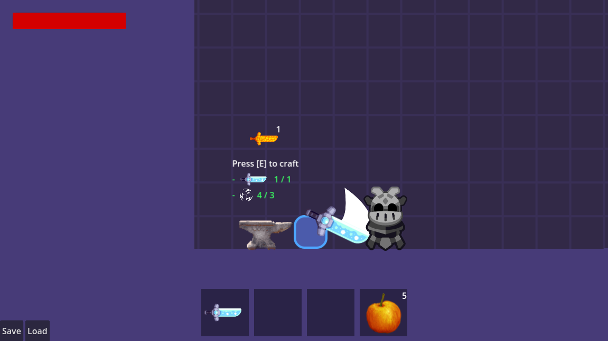

# Game Example

How would this system look in a game.

This example showcases how it would integrate with existing game. It's a bit more complex, because the code has other bits and pieces, but shows how dynamic the system actually is. Suggesting to look at this example after viewing the **Basic Example**!

You can find it under _res://examples/game/level.tscn_

It includes:
- A platformer game, with weapons that can be used against enemies
  - the Movement controller has Variable Jump, Coyote Timer, Jump Buffer
- Player with HealthBar, Backpack Inventory, Hotbar
- `PickupItem` scene that shows how to add items to the inventory when interacting with them.
- Chest, that can be opened and it has it's own Inventory Component
- Saving and Loading
- Crafting!
- Creating item types such as Weapons and Food