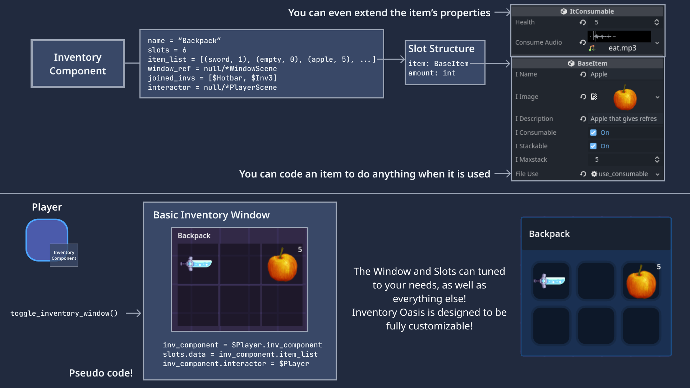

# Introduction
Welcome to Inventory Oasis, a powerful inventory management system built exclusively on the Godot 4 engine's new resources. This system is tightly integrated with the engine, providing an awesome user experience. With Inventory Oasis, you can manage your inventory with ease, adding and editing items directly through the Inspector.

One of the key benefits of Inventory Oasis is its flexibility. Every item can be extended with custom properties and custom use functions, allowing you to tailor the system to your specific needs. This means you can easily add new item types or modify existing ones to fit your workflow.

Thanks to the close integration with the Godot 4 engine, Inventory Oasis provides a seamless experience for game developers and designers. Whether you're building a 2D or 3D game, you can take advantage of Inventory Oasis's powerful features to manage your game assets with ease.

In this documentation, you will learn how to use Inventory Oasis to manage your inventory, create new items, and customize the system to fit your needs. We will walk you through the process step by step, providing clear instructions and helpful tips along the way.

We hope that you find Inventory Oasis to be a valuable addition to your game development toolkit. Whether you're a seasoned developer or just getting started with Godot 4, Inventory Oasis can help you streamline your workflow and create amazing games.

# Overview

You have an **Inventory Component** that can be attached to **any** scene. The data is stored in this component, together with some helpful functions. (Can be attached to Player, Chest, etc...)

**Items** are Godot Resources that can be extended with custom properties and functions. Editable through the Inspector!

**Inventory Slots** hold information about the item structure and the quantity of the item. This information is accessed through the Inventory Component.

**Inventory Window** just makes an array of Slots and sets the interactor of the inventory to whoever accesses it.

**Saving** and **Loading** system. We have included example demos to showcase how to save and load inventory data, which can be easily adapted to fit your specific use case.

**Crafting** in the Game Example!

# Video Tutorial

_TODO_

# [Examples](./category/examples)