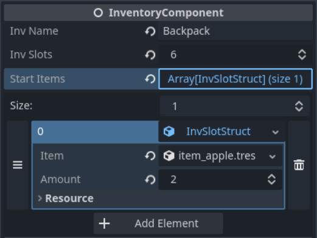

# Inventory Component

This is a script that can be attached to any node and it turns it into a component.
This component can be a child of any scene _(Player, Chest, etc...)_


You can modify some of the properties of the **Inventory Component** right in the inspector!



## Properties

|                           |                                      |          |
| ------------------------- | ------------------------------------ | -------- |
| String                    | [inv_name](#prop-inv-name)           | `"Name"` |
| int                       | [inv_slots](#prop-inv-slots)         | `5`      |
| Array[InvSlotStruct]      | [start_items](#prop-inv-start-items) |          |
| Array[InvSlotStruct]      | [inv_item_list](#prop-inv-item-list) |          |
| InvWindow                 | [window_ref](#prop-window-ref)       | `null`   |
| Array[InventoryComponent] | [joined_invs](#prop-joined-invs)     |          |
| Object                    | [interactor](#prop-interactor)       | `null`   |

## Methods

|                  |                                                                                                                 |
| ---------------- | --------------------------------------------------------------------------------------------------------------- |
| bool             | [add_to_inv](#heading-id) ( [BaseItem](#heading-id) struct, [int](#heading-id) amount )                         |
| Array[bool, int] | [inv_query](#heading-id) ( [String](#heading-id) item_name, [int](#heading-id) item_amount )                    |
| bool             | [inv_remove_by_name](#heading-id) ( [String](#heading-id) item_name, [int](#heading-id) item_amount )           |
| void             | [use_item_at_slot](#heading-id) ( [int](#heading-id) index )                                                    |
| void             | [refresh_slot_at_index](#heading-id) ( [int](#heading-id) index )                                               |
| void             | [swap_items_by_ref](#heading-id) ( [InvSlotStruct](#heading-id) from_ref, [InvSlotStruct](#heading-id) to_ref ) |

## Property Descriptions

### _String inv_name = "Name"_ {#prop-inv-name}
This is used for the name when creating an Inventory Window. Not required, can be left empty or unmodified.

### _int inv_slots = 5_ {#prop-inv-slots}
How many slots an Inventory has.

### _Array[InvSlotStruct] **start_items**_ {#prop-inv-start-items}
You can add them through the inspector. These items will be added to the Inventory Component on the start of the game.

### _Array[InvSlotStruct] inv_item_list_ {#prop-inv-item-list}
This Array holds the data to all your items. Many nodes thoughout the system use this array to show the needed data.

### _InvWindow window_ref = null_ {#prop-window-ref}
When spawning an Inventory Window, you should set the `window_ref` to the Window. When you destroy the Window, you should set this to null. Used in the `refresh_slot_at_index` function, because the `InvWindow` has access to every slot, and when using a slot we need to update it.

### _Array[InventoryComponent] joined_invs_ {#prop-joined-invs}
You can join inventories together, example: hotbar with backpack. This way when you call function such as `inv_query` or `add_to_inv`, it will check the inventory component the function is called from, and all the **joined_invs** in it.

### _Object interactor = null_ {#prop-interactor}
Every inventory should have an interactor while it is being used/opened. That way the items, when used can call functions directly on the interactor. Example: a chest with inventory component has no interactor until a player opens it. When a player opens the chest, the interactor of the inventory component on the chest should be set to the Player. If the chest has an apple and we decide to eat it, the apple has access to the interactor and can check if the interactor has an function called `update_health` and if it has it, it will call it.

## Method Descriptions

### _bool add_to_inv ( BaseItem struct, int amount )_
Adds an item with the specified amount to the inventory. If successful returns true, else false. Can return false if the inventory is already full.

### _Array[bool, int] inv_query ( String item_name, int item_amount )_
Returns if the inventory has enough of an item, and how much is the total amount.
```gdscript
var query = inv_query("Item1", 2)
query[0] # -> bool, is the query successful
query[1] # -> int, total amount of this item in inv
```

### _bool inv_remove_by_name ( String item_name, int item_amount )_
Removes an item from the Inventory by a name

### _void use_item_at_slot ( int index )_
Calls the `i_use()` function of an item at the specified index, if the item is consumable, substracts it by 1

### _void refresh_slot_at_index ( int index )_
Usually called by the `InvSlot`, when using an item, it needs to be updated.

### _void swap_items_by_ref  ( InvSlotStruct from_ref, InvSlotStrcut to_ref )_
Used in drag and drop. Swaps two items. If you use this function, you should call `refresh_slot_at_index()` after it.