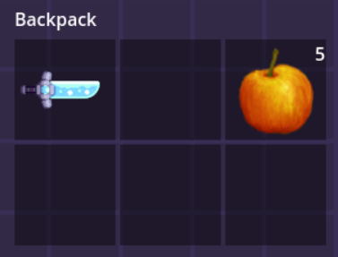
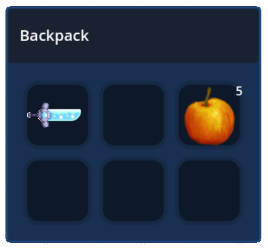

# Inventory Window

`InvWindow` is a script that can be attached to any scene that acts as an Inventory Window. There is a basic scene provided to you for use, which can be edited to your needs, it's located under _res://addons/inventory_oasis/ui/BasicInvWindow.tscn_. You can take a quick look at it, and create entirely new scene, or just use this one as a base.

Here is a screenshot of the default scene, and a modification that can be done in a few clicks.





## How to use

There is an `ToggleInventory` script located under _res://addons/inventory_oasis/system/toggle_inventory.gd_ that takes care of it for you. It's recommended to look at it and understand how it works, because you'll probably need to modify it for your game. It's just an example, you can either use it and modify it, or recreate your own based on it. 

This script can be attached to any node. And through the inspector you set what Inventory Window scene to spawn, select to which Inventory Component this window should belong and the target node, to spawn it under. This script is usually attached to a node under the Player scene, and it assumes that the owner of the scene will be the _interactor_ of the Inventory Component. 

If it sounds a bit complicated, please take a look at the examples provided, it should get a lot clearer!

```gdscript
func toggle_inventory():
	if not is_instance_valid(window_ref):
		window_ref = window_scene.instantiate()
		window_ref.init(inv_component)
		inv_gui_target.add_child(window_ref)
		
		inv_component.interactor = get_owner()
		#Input.set_mouse_mode(Input.MOUSE_MODE_VISIBLE)
	else:
		inv_component.window_ref = null
		inv_component.interactor = null
		window_ref.queue_free()

        #Input.set_mouse_mode(Input.MOUSE_MODE_CAPTURED)
```

This is most of the code this script has.